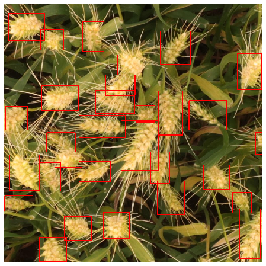

# Global-Wheat-Detection

Notebooks made for the Kaggle Global Wheat Detection Competition

The Exploratory Data Analysis notebook maybe too big to be loaded by GitHub, in that case the same notebook can be viewed <a href = "https://www.kaggle.com/daenys2000/global-wheat-detection-eda"> here</a> on Kaggle.

The training notebook can be found on Kaggle <a href = "https://www.kaggle.com/daenys2000/fasterrcnn-pytorch">here</a>.

The model used for training is Faster RCNN with a densenet169 backbone.Using a densenet backbone rather than a resnet backbone improved performance. Using an SGD optimizer with a learning rate of 0.01 and momentum of 0.9 gave better results than using an adaptive gradient descent algorithm like Adam or AdaMax.

## Libraries used:
1. PyTorch
2. Albumentations
3. Numpy
4. Pandas
5. Matplotlib
3. Seaborn

## Results
</img>

## Improvements Possible:
1. Using Ensemble methods like <a href = "https://arxiv.org/abs/1910.13302">Weighted Boxes Fusion</a>.
2. Using Stratified KFold
3. Using more diverse forms of data augmentation( only flipping used in the notebook).
4. Using EarlyStopping to prevent overfitting.
